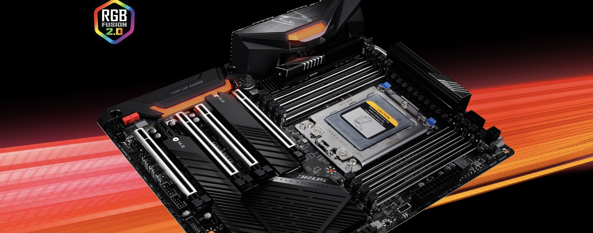

# EFI_TRX40
**Ryzentosh EFI for the Gigabyte TRX40 motherboard**

## Hardware List

**Specific model:** [TRX40 AORUS PRO WIFI](https://www.gigabyte.com/Motherboard/TRX40-AORUS-PRO-WIFI-rev-10#kf)

|   Hardware   |                       Information                       | status |
| :----------: | :-----------------------------------------------------: | :----: |
|    `CPU`     |     AMD Ryzen Threadripper 3960X 24-Core Processor      |   ✅    |
|    `GPU`     |          AMD Radeon RX Vega 64 Liquid Edition           |   ✅    |
|    `USB`     |             Internal / External Usb mapping             |   ✅    |
|    `WIFI`    |        Intel® Corporation Wi-Fi 6 AX200 (rev 1a)        |   ✅    |
|  `Audio#0`   |                    Realtek USB Audio                    |   ✅    |
|  `Audio#1`   |            AMD Radeon RX Vega 10 HDMI Audio             |   ✅    |
| `Bluetooth`  |               Intel® Wireless Bluetooth®                |   ✅    |
| `Ethernet#0` |           Intel® Ethernet Controller I211-AT            |   🚫    |
| `Ethernet#1` | Realtek RTL8168 PCI Express Gigabit Ethernet Controller |   ✅    |

## BIOS Setting
May not all options are present in your firmware. Do not be too concerned if many of these options are not available in your BIOS.
### Disable
- Fast Boot
- Secure Boot
- Serial/COM Port
- Parallel Port
- CSM (Compatibility Support Module)
- IOMMU
> For 3990X users: macOS currently does not support more than 64 threads in the kernel, and so will kernel panic if it sees more. The 3990X CPU has 128 threads total and so requires half of that disabled. We recommend disabling hyper threading in the BIOS for these situations.
### Enable
- Above 4G Decoding
> For Gigabyte/Aorus or an AsRock motherboard, if it breaks certain drivers (Ethernet) or boot failures on other OSes, if it does happen then disable this option and opt for npci instead.

> For 2020+ BIOS, If the Resizable BAR support is in your BIOS, it could be enabled when enabling Above 4G. Please ensure that `Booter` -> `Quirks` -> `ResizeAppleGpuBars` is set to `0`
- EHCI/XHCI Hand-off
- OS type: Windows 8.1/10 UEFI Mode (Or maybe "Other OS" instead)
- SATA Mode: AHCI

## Special note
### Why I can not detect OTA and OTA updates failures?
The default model is MacPro7,1. Without patch, it may not detect OTA updates successfully on macOS sonoma. It needs extra booting arguments that comes from [restrictEvents](https://github.com/acidanthera/RestrictEvents) driver. Add extra boot-args `revpatch=auto,asset,sbvmm` to `NVRAM` -> `Add` -> `7C436110-AB2A-4BBB-A880-FE41995C9F82` -> `boot-args` **(Fixed)**

Users of the **Intel wireless adapter plantform** need special attention: In addition to applying the above patch, you also need to disable Bluetooth-related drivers. They usually are：
- IntelBTPatcher
- IntelBluetoothFirmware
- BlueToolFixup or BrcmBluetoothInjector
  
After finishing updates, please re-enable related bluetooth drivers.

## Help
### Before your installation
  1. check your BIOS setting
  2. check your installed hardware
  3. Add or remove driver according result of checking hardware and individual needs
  4. Modify config file and save
  5. Start to install and have a good luck

For more information, please see: [AMD Ryzen and Threadripper(17h and 19h)](https://dortania.github.io/OpenCore-Install-Guide/AMD/zen.html#starting-point) documentation.

> Attention: The default config does not contain a valid setting of SMBIOS & Serial ID and so on. To make iService works well, you could use CropNewt's [GenSMBIOS](https://github.com/corpnewt/GenSMBIOS) application. Looking for usages: [Setting up the SMBIOS info](https://dortania.github.io/OpenCore-Install-Guide/AMD/zen.html#platforminfo)

### What version of macOS can I install ?
- Monterey
- Ventura
- Sonoma
> The version before macOS Monterey is not supported！If you need, please submit issue and let me know to deliver appropriate package.

### MimoWhiteList setting for TRX40
Although you may have same motherboard series with above one. For TRX40 users, you need to find out and calculate MimoWhiteList patches by yourselves. Each change and software update of BIOS would probably change memory regions that need to be patched, it includes the same motherboard but different envirnoment. Recommend not to use configuration directly without setting your own MimoWhiteList patches. This applies to all TRX40 series.

If you want to know more details about the quirk - MimoWhiteList，please see [Using DevirtualiseMmio](https://dortania.github.io/OpenCore-Install-Guide/extras/kaslr-fix.html#using-devirtualisemmio)

### Not the model of my cpu ?
Just figure out the model of your ryzen / threadripper cpu.
You can fix the patches by yourselves according to [AMD_Vanilla](https://github.com/AMD-OSX/AMD_Vanilla). 

### How can I do when my hardware is not included in list ?
The list that displays various hardware is installed for myself, you could correct configuration file by yourself if you have other hardware. Similarly, if some hardwares which are displayed above is not installed on your machine. You could manually set related driver to disable status in configuration file.

### Why I211-AT did not get support ?
I211-AT is not officially supported by Apple. There is no stable driver for this ethernet card now:
- **SmallTreeIntel82576 driver** has reached end of support in macOS Bigsur.
- **AppleIGB driver** lacked stability and has stopped updates.

It is highly recommended to replace a network card that can be supported.

#### Can I flash it to Driver-free card（I210-AT）to solve problem ？
**Not recommended at all!** It is okay for router running openwrt, windows server or nas envirnoment but not Ryzentosh.
The originally official driver - AppleIntelI210Ethernet for I210-AT which was written by apple has been removed after macOS monterey. 
Now the driver for I210-AT - AppleIEthernet1000 relies on DriverKit Framework that was developed by apple. Most importantly, DriverKit relies on Intel® Vt-d technology so that is unavailable on AMD plantform. You may experience unexpected restarts or inability to sign in when you plug in network-cable.

### Submit issue
If you have encountered any problem or you have any advice & request, please submit it into issue and we will take it seriously.

## Credits
- [Acidanthera](https://github.com/acidanthera) for OpenCorePKG and drivers.
- [daliansky](https://github.com/daliansky) and others for ACPI patches - OC-little
- [CorpNewt](https://github.com/corpnewt/) for providing powerful tool - GenSMBIOS,ProperTree and so on
- [AMD-OSX](https://github.com/AMD-OSX) for AMD_Vanilia